
# final-project-skeleton

* Team Number: 11
* Team Name: Circuit Breakers
* Team Members: Eshan Singhal, Mohit Shah, Nandini Swami
* GitHub Repository URL: https://github.com/upenn-embedded/final-project-s25-the-circuit-breakers
* GitHub Pages Website URL: [for final submission]

## Final Project Proposal

### 1. Abstract

MicroBeat is an interactive at-home music production system that allows users to create and manipulate sounds using various input sensors. The system integrates pressure sensors for drum simulation, a potentiometer for volume control, and an accelerometer for dynamic sound modulation. The DFPlayer Mini MP3 module handles audio output, enabling seamless playback through a connected speaker. By combining these components, MicroBeat transforms user interactions into a live DJ-style music experience, making music production more accessible and engaging.

### 2. Motivation

*What is the problem that you are trying to solve? Why is this project interesting? What is the intended purpose?*

Traditional DJ sets contain a multitude of complex components with turntables, mixers, and MIDI components that require a relatively large learning curve. Additionally, this static setup can be limiting in terms of expressive control which constrains creativity.

This project is very interesting because we ideate and develop a more expressive, intuitive medium to control music with various complex sensors. The intended purpose is to enable more complex DJing while increasing accessibility.

### 3. System Block Diagram

Hardware Design:

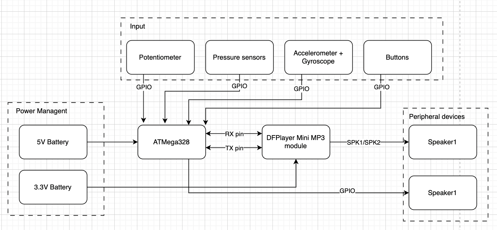

Software Design:

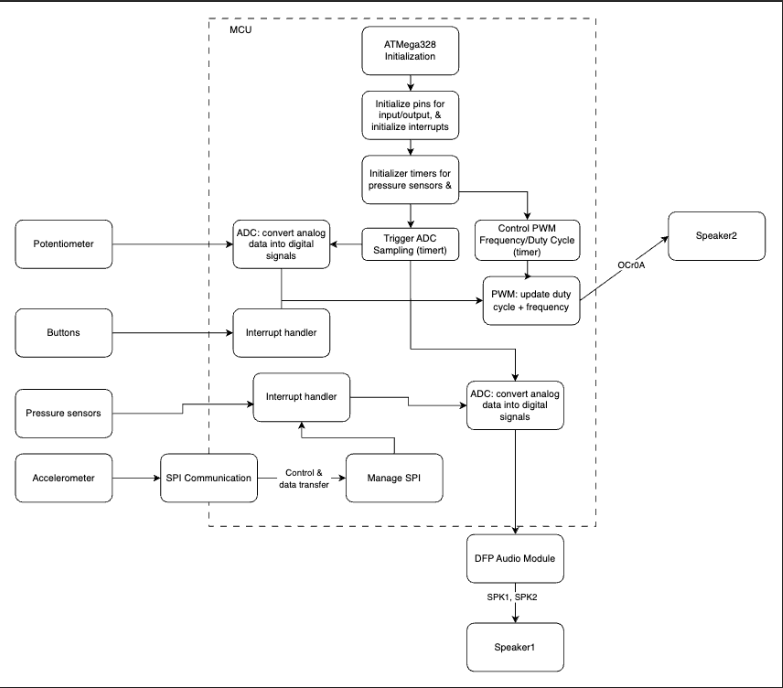

### 4. Design Sketches

The project will consist of a module that houses the ATmega328PB, speakers, and other core electronic components. There will be a separate component with various drum pads using pressure sensors as well as wristband with the accelerometer/gyroscope.

Critical design features?

There will be some special manufacturing techniques required such as 3D printing/laser cutting to create housing for the electronics, 3D printing to create the drum pads, and 3D printing to create the wristband for the accelerometer/gyroscope.

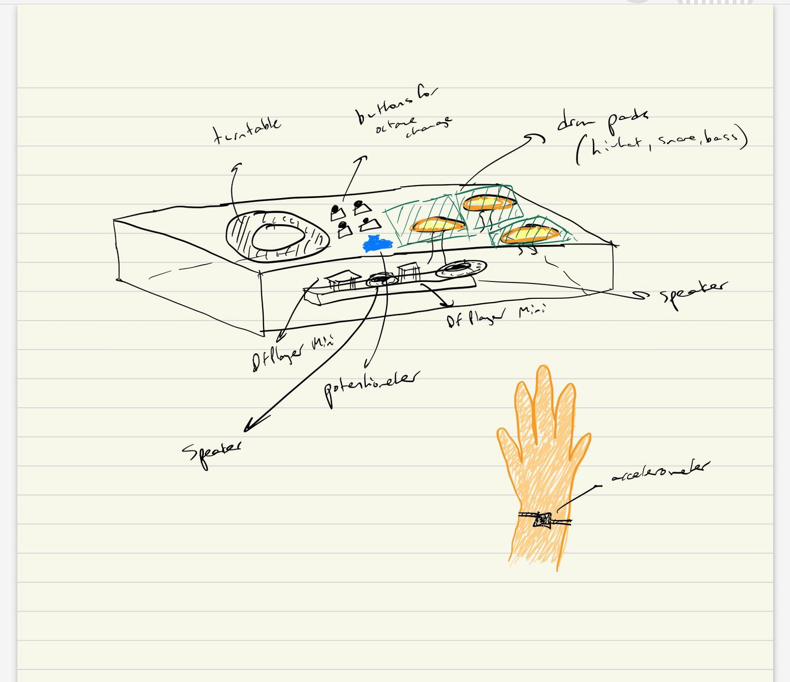

We will need to 3D print a box to place the three subsystems of our project. On the base of the box, the turntable will be printed onto the base and the pads are placed to the right. Platforms will be placed above the pressure sensors and the circuitry will be placed inside the box (breadboard + wiring for the sensors). The accelerator is tied to the wrist using a band for use in simulating the turntable.

### 5. Software Requirements Specification (SRS)

*Formulate key software requirements here. Think deeply on the design: What must your device do? How will you measure this during validation testing? Create 4 to 8 critical system requirements.*

*These must be testable! See the Final Project Manual Appendix for details. Refer to the table below; replace these examples with your own.*

**5.1 Definitions, Abbreviations**

Here, you will define any special terms, acronyms, or abbreviations you plan to use for hardware

**5.2 Functionality**

| ID     | Description                                                                                                                                                                                                              |
| ------ | ------------------------------------------------------------------------------------------------------------------------------------------------------------------------------------------------------------------------ |
| SRS-01 | Real time sensor input processing: System shall accurately detect pressure changes (drums), potentiometer adjustments (note change), and accelerometer motion to trigger corresponding audio responses. To validate this we shall use an oscilloscope or logic analyzer to verify signal integrity and response time from sensors to the ATmega328’s input pins.                                                                                                                |
| SRS-02 | Communication between AtMega and DFP Module: The system shall send UART commands to the DFPlayer Mini MP3 module with minimal delay to ensure immediate sound output upon input detection. We shall validate this by measuring delay between input activation and audio playback using timestamp logging.                                                                                                                                         |
| SRS-03 | ADC Input handling: The potentiometer (volume control) and pressure sensors shall be read via ADC, mapped to corresponding levels, and converted into digital signals for audio processing. We shall validate this by comparing raw ADC values with expected sensor outputs to ensure accurate readings within ±5% error margin. |
| SRS-04 | Piano note generation + Pitch control (PWM): The system shall detect button presses and assign the corresponding octave by setting a predefined frequency range. The system shall read the potentiometer's ADC value and map it to specific note frequencies within the selected octave. The system shall use Timer1 (OCR1A register) to generate a PWM square wave at the required frequency based on the selected octave and note. We shall use an oscilloscope to verify correct frequency output for each button press and potentiometer adjustment.                                                                                |
| SRS-05 | Turntable movement detection: The system shall detect certain shapes from the accelerometer/gyroscope setup such as a circular motion, shaking, and vertical movement. We shall test this functionality by rigorously testing the setup in a real environment to determine if the desired shape is being recorded.|

### 6. Hardware Requirements Specification (HRS)

*Formulate key hardware requirements here. Think deeply on the design: What must your device do? How will you measure this during validation testing? Create 4 to 8 critical system requirements.*

*These must be testable! See the Final Project Manual Appendix for details. Refer to the table below; replace these examples with your own.*

**6.1 Definitions, Abbreviations**

Here, you will define any special terms, acronyms, or abbreviations you plan to use for hardware

**6.2 Functionality**

| ID     | Description                                                                                                                        |
| ------ | ---------------------------------------------------------------------------------------------------------------------------------- |
| HRS-01 | The pressure sensors shall carry a maximum load of 1 kg of applied force and measurements above this threshold shall saturate to 1 kg. Connected to a speaker, drum pads attached to the sensors shall mimic sounds of a hi-hat, snare, and bass drum. ADC readings shall change the volume of these sounds according to the pressure applied. |
| HRS-02 | The potentiometer shall be set at one of 8 notes in the current octave, depending on the amount turned. A max voltage of 5 V shall be measured at the nodes of the potentiometer before input to the ADC. 8 concurrent voltage ranges of step size 0.4 V shall be used to differentiate between each note.                                                           |
| HRS-03 | Speakers shall be used to output preloaded music and signals sent from the piano and drum pads. This shall be validated through using the DFPlayer module where 30 module levels dictate the volume at which the signal is sent at.                      |
| HRS-04 | The IMU should have a 500 Hz sampling rate because it should be sufficient to detect most fast hand motions. We can test if this condition is met by sampling for 1 second and confirming the number of recorded samples is 500. |
| HRS-05 | The IMU should also have accurate relative position and rotation accuracy. This can be tested by making various hand motions and confirming that the motion is being accurately represented by the IMU via 3D plotting. |

### 7. Bill of Materials (BOM)

*What major components do you need and why? Try to be as specific as possible. Your Hardware & Software Requirements Specifications should inform your component choices.*

*In addition to this written response, copy the Final Project BOM Google Sheet and fill it out with your critical components (think: processors, sensors, actuators). Include the link to your BOM in this section.*

The components we need include 3 piezo pressure sensors to represent the snare, hi-hat, and the bass drum. The preferred type had a range of 0 lbs to 4.4 lbs., as nothing more than the max was needed due to continuous playing (taps). The DFPlayer Mini allows for manipulation with prerecorded audio and speaker output. The accelerometer is crucial as it changes audio according to circular or vertical motion of the device attached to the wrist, simulating a turntable.

[Final Project BOM Link](https://docs.google.com/spreadsheets/d/1Nn4dQrrRypU64VvPleaDI948HICvbxTs2iRi9GGM9Bo/edit?usp=sharing)

### 8. Final Demo Goals

*How will you demonstrate your device on demo day? Will it be strapped to a person, mounted on a bicycle, require outdoor space? Think of any physical, temporal, and other constraints that could affect your planning.*

We will demo the device by playing a preloaded song and individually demonstrating the functionality of each subsystem and explain the underlying hardware and software implementation and conclude by using all components simultaneously. Additionally, the accelerometer will be strapped to the wrist when controlling speed of the song. The piano will be tested separately by showing different notes by twisting the potentiometer and pressing buttons to change octave.

### 9. Sprint Planning

*You've got limited time to get this project done! How will you plan your sprint milestones? How will you distribute the work within your team? Review the schedule in the final project manual for exact dates.*

| Milestone  | Functionality Achieved | Distribution of Work |
| ---------- | ---------------------- | -------------------- |
| Sprint #1  |  Source all the hardware and plan the structure and exact functionality of software and build CAD                      |  Eshan: Turntable/Sound morpher, Mohit: Drum pads, Nandini: Piano                    |
| Sprint #2  | Build software and generate cohesive working prototype                       |  Eshan: Turntable/Sound morpher, Mohit: Drum pads, Nandini: Piano                    |
| MVP Demo   |  Work through integration bugs and flow                      | Working together to solve issues                     |
| Final Demo |   Rigorously test and enable additional functionality (if possible)                     |   Working together to solve issues                   |

**This is the end of the Project Proposal section. The remaining sections will be filled out based on the milestone schedule.**

## Sprint Review #1

### Last week's progress
We have built the part of the circuit that will be used for the piano, which controls piano notes and octaves. To control the keys in the octave, we switched from the potentiometer to a rotary encoder. The octave is controlled by 2 buttons that send the octave up or down. For now, the output is connected to a buzzer but when our parts arrive we will be using a speaker instead. We have also ordered parts and are discussing things to work on during the time that parts don't arrive.

### Current state of project
We are currently waiting on the arrival of crucial parts to our project. In the meantime, we each have been sourcing available parts from lab, doing research for our implementation, and working on parts that are not dependent on the DFP Audio Module. Currently, we have the piano part of the circuit set up and almost fully working (will be complete when speaker arrives). 

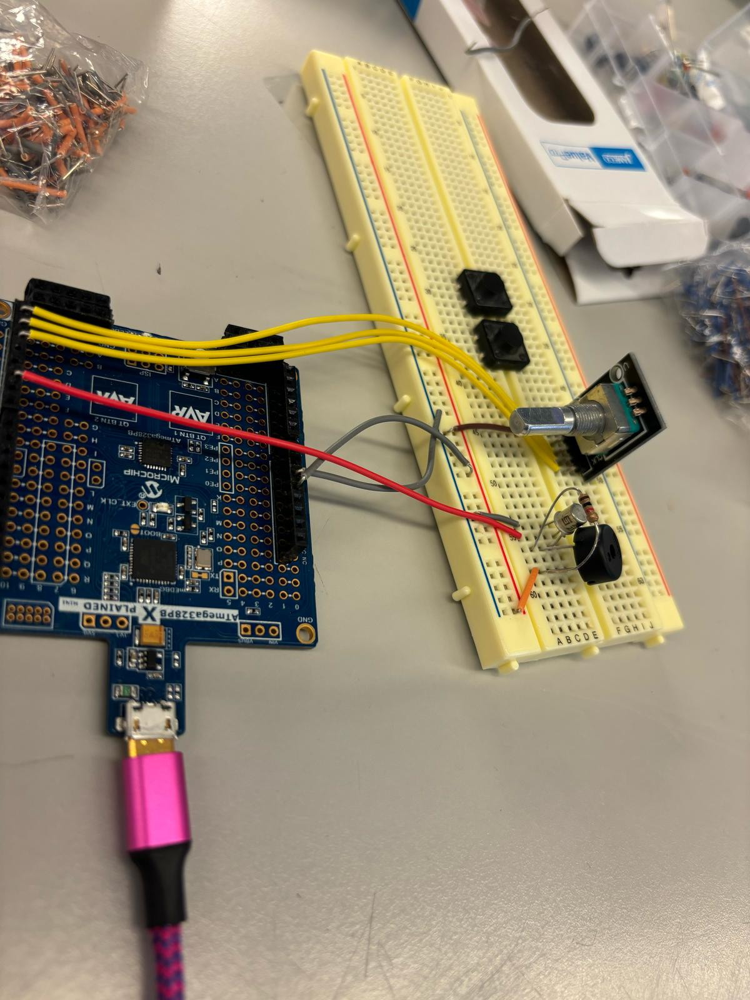

### Next week's plan
For the coming week we are expecting the DFP module to arrive as well as the other parts. First we can finish off the piano part of the project by connecting the speaker to the circuit. We will work on learning how to use the DFP module including uploading MP3 files to it, connecting it to the ATMega328 and connecting our speaker to test output. Once this is working we are going to aim to finish the circuitry set up for the pressure pads for the drum beats and the set up for the gyroscope and accelerometer. Once we can properly read in input then the following week we can work on refining the code. Along with this, we will aim to have a rough draft for our 3D printing.  

## Sprint Review #2

### Last week's progress
Last week, we did research on the three primary subsytems for our DJ set, the piano, drums, and IMU control. We each worked individually on parts not dependent on the DF Player Module and helped each other out on the implementation of certain tasks. The piano keys circuitry is complete including the buzzer and rotary encoder. We are recieving input values from the encoder and outputting different frequencies but facing a challenge wehre certain frequencies are not playing. The IMU wiring is done and is being tested. The force sensors were also wired to the breadboard and experimented with using ADC.

### Current state of project
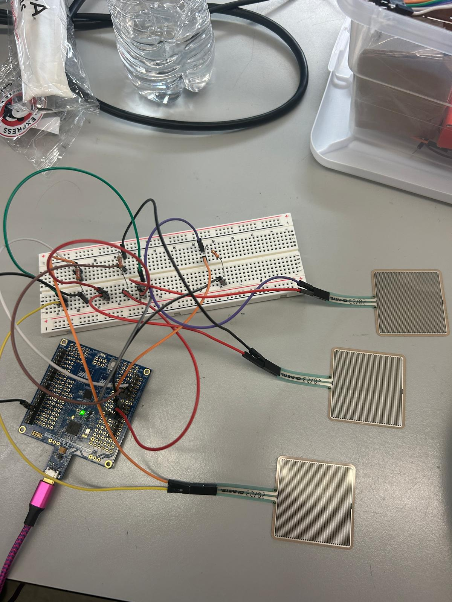

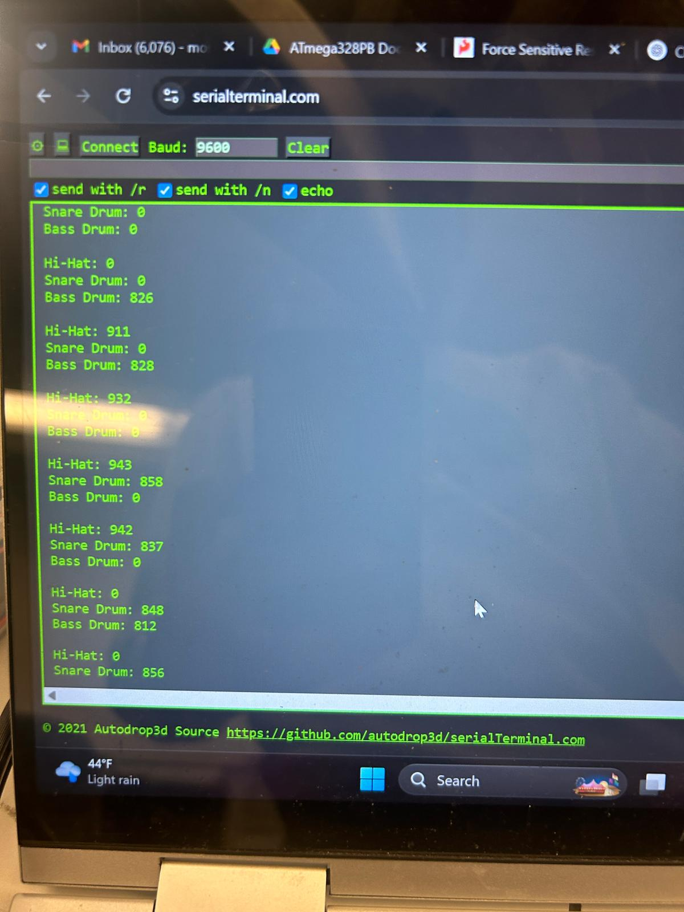

We have received the parts we ordered and are currently working on individual parts of the DJ set, focusing on bringing everything together through power management. Software for the IMU is in progress and the force sensors have been implemented through ADC. We are also focusing on debugging software and hardware for the piano based on the buttons and knob.

### Next week's plan
The plan for next week is to mainly implement the DFP module for use in our project, generating sounds at different volumes. The module's input will be an ADC read from 3 channels of the force sensors, representing the hi-hat, snare drum, and bass drum. One of the primary tasks is to interface the sensors' output with the input of the module, and gaining familiarity with how to program the player in Arduino IDE. Another task is to write the I2C driver for the IMU and moving towards implementation of motion feedback for the generated tunes. We will then test out the IMU with the rest of the system. For the piano, we want to fix our current bug with specific frequencies and change the output from a buzzer to a speaker. We want to also use the oscilloscope to capture signals for testing. 

## MVP Demo

1. Show a system block diagram & explain the hardware implementation.
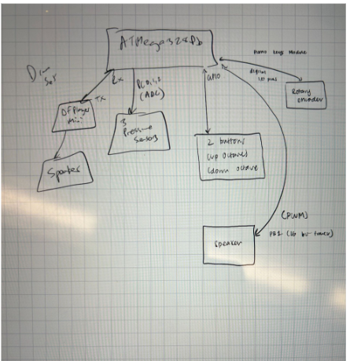
The ATMega328PB controls all three parts of MicroBeat, the piano, drumset, and IMU implementation. The microcontroller is connected to the DF Player Mini Module through an RX to TX connection. The DF Player Mini is then wired to the speaker output. Additionally, the microcontroller is wired to the three force sensors, simulating a snare, bass drum, and a hi-hat. For the piano, the rotary encoder and buttons are connected to the microcontroller through GPIO and the speaker is connected through PWM. The IMU is connected to a separate ATMega328Pb and will eventually be wired to another DF Player Mini for song modulation (playback speed and pause functionality).

2. Explain your firmware implementation, including application logic and critical drivers you've written.
The code for the piano is based on PWM, changing OCR1A and OCR1B according to a range of 8 notes across 4 octaves. The code for the drumset is based on ADC conversion, noting that the complete range of ADC values based on force to the sensor is from 0 to 900. Additionally, the DF Player Module plays music, change volume, and performs other commands through a series of 10 bytes sent one-by-one over UART between the microcontroller. The IMU is powered by an IMU driver consisting of functions that read the accelerometer and the gyroscope.

3. Demo your device.
[Slideshow Link](https://docs.google.com/presentation/d/1nYgInTRyewJpaWn2flAvf959YhefqQQz_XKIyyjOefc/edit?usp=sharing)
Demoed with James

4. Have you achieved some or all of your Software Requirements Specification (SRS)?
We have achieved only one sound being playing at a time for the drumset through ADC testing and finding the threshold where exactly one of the sensors activates. We have also tested frequencies and ensured that OCR1A is set appropriately by measuring the oscilloscope.

   1. Show how you collected data and the outcomes.
<<<<<<< Updated upstream
Data was collected through printing out to the serial monitor and cross-checking measurements onto the scope. The serial data printed is similar to last week's sprint.
=======

Checking PWM encodings through oscilloscope:
Key 0, octave 0 ~ expected: 523 Hz, actual: 522 Hz
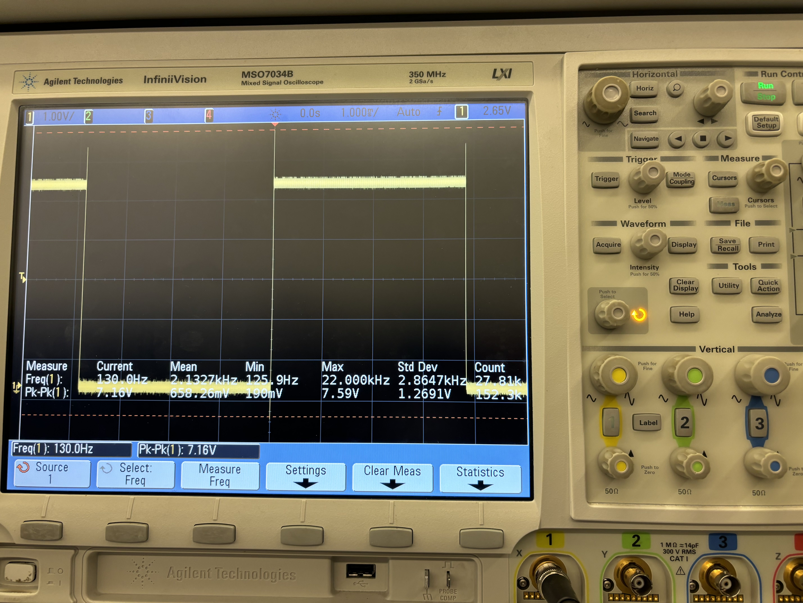

Key 0, octave 1 ~ expected: 261 Hz, actual: 522 Hz
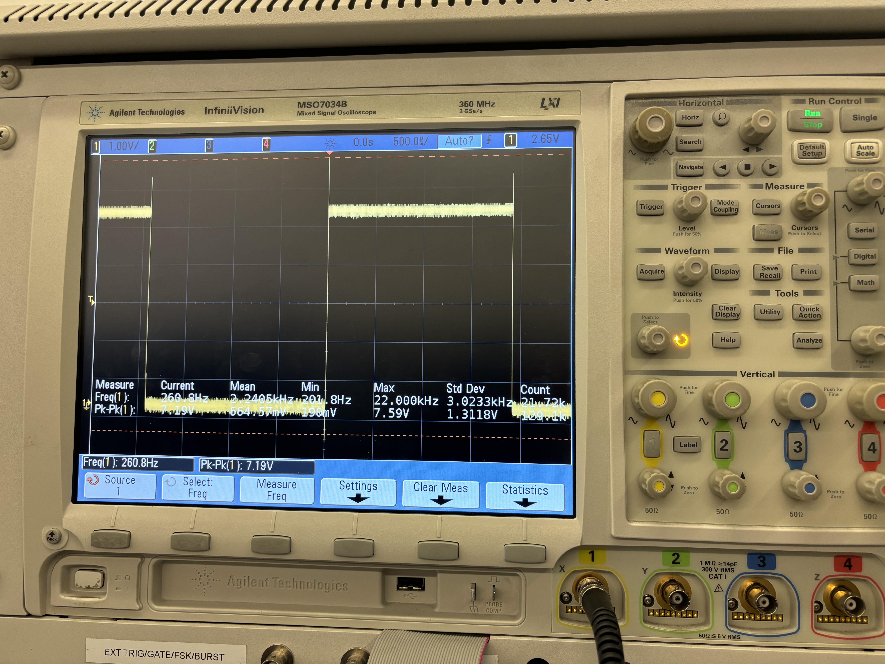

Key 0, octave 2 ~ expected: 1046 Hz, actual: 522 Hz
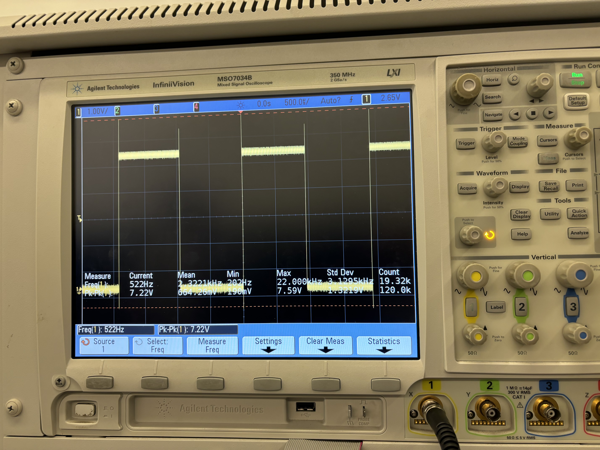

Key 0, octave 3 ~ expected: 1046 Hz, actual: 522 Hz
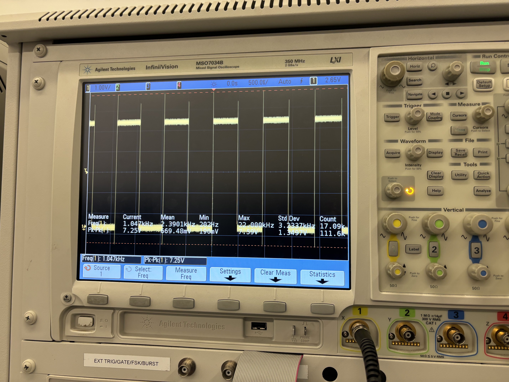

>>>>>>> Stashed changes

5. Have you achieved some or all of your Hardware Requirements Specification (HRS)?
We did achieve the 

   1. Show how you collected data and the outcomes.
6. Show off the remaining elements that will make your project whole: mechanical casework, supporting graphical user interface (GUI), web portal, etc.
7. What is the riskiest part remaining of your project?
The riskiest part remaining is to integrate all individual parts together. This will require thorough planning based on where we want to position the circuits and other parts like the speakers.

   1. How do you plan to de-risk this?
We plan to de-risk this by optimizing and considering what pins are needed from all of the individual parts before integrating into the overall circuit. There is a possibility for pin overlap, requiring us to make changes to our code such as timers if needed. We will also all come into the lab one day to fit everything together on the box.

8. What questions or help do you need from the teaching team?

The primary question we will ask the teaching team is how to power our device without connection from the laptop. During our MVP demo, James told us so use the voltage power supply as our power source so that's what we'll do. Additonally, our next challenge is to be able to attach the IMU to the wrist using a band, while still connected via I2C to the microcontroller. Testing out the IMU, we realized only a few feet above and below the origin are possible to achieve so this will be taken into consideration.

## Final Project Report

Don't forget to make the GitHub pages public website!
If you’ve never made a GitHub pages website before, you can follow this webpage (though, substitute your final project repository for the GitHub username one in the quickstart guide):  [https://docs.github.com/en/pages/quickstart](https://docs.github.com/en/pages/quickstart)

### 1. Video

[Insert final project video here]

* The video must demonstrate your key functionality.
* The video must be 5 minutes or less.
* Ensure your video link is accessible to the teaching team. Unlisted YouTube videos or Google Drive uploads with SEAS account access work well.
* Points will be removed if the audio quality is poor - say, if you filmed your video in a noisy electrical engineering lab.

### 2. Images

[Insert final project images here]

*Include photos of your device from a few angles. If you have a casework, show both the exterior and interior (where the good EE bits are!).*

### 3. Results

*What were your results? Namely, what was the final solution/design to your problem?*

#### 3.1 Software Requirements Specification (SRS) Results

*Based on your quantified system performance, comment on how you achieved or fell short of your expected requirements.*

*Did your requirements change? If so, why? Failing to meet a requirement is acceptable; understanding the reason why is critical!*

*Validate at least two requirements, showing how you tested and your proof of work (videos, images, logic analyzer/oscilloscope captures, etc.).*

| ID     | Description                                                                                               | Validation Outcome                                                                          |
| ------ | --------------------------------------------------------------------------------------------------------- | ------------------------------------------------------------------------------------------- |
| SRS-01 | The IMU 3-axis acceleration will be measured with 16-bit depth every 100 milliseconds +/-10 milliseconds. | Confirmed, logged output from the MCU is saved to "validation" folder in GitHub repository. |

#### 3.2 Hardware Requirements Specification (HRS) Results

*Based on your quantified system performance, comment on how you achieved or fell short of your expected requirements.*

*Did your requirements change? If so, why? Failing to meet a requirement is acceptable; understanding the reason why is critical!*

*Validate at least two requirements, showing how you tested and your proof of work (videos, images, logic analyzer/oscilloscope captures, etc.).*

| ID     | Description                                                                                                                        | Validation Outcome                                                                                                      |
| ------ | ---------------------------------------------------------------------------------------------------------------------------------- | ----------------------------------------------------------------------------------------------------------------------- |
| HRS-01 | A distance sensor shall be used for obstacle detection. The sensor shall detect obstacles at a maximum distance of at least 10 cm. | Confirmed, sensed obstacles up to 15cm. Video in "validation" folder, shows tape measure and logged output to terminal. |
|        |                                                                                                                                    |                                                                                                                         |

### 4. Conclusion

Reflect on your project. Some questions to address:

* What did you learn from it?
* What went well?
* What accomplishments are you proud of?
* What did you learn/gain from this experience?
* Did you have to change your approach?
* What could have been done differently?
* Did you encounter obstacles that you didn’t anticipate?
* What could be a next step for this project?

## References

Fill in your references here as you work on your final project. Describe any libraries used here.
